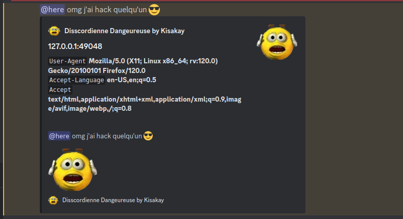

# Image IP Grabber

Ce projet a été créé dans un esprit ludique pour explorer la créativité dans le monde de la programmation. Il propose une approche originale pour récupérer des adresses IP à partir d'images sur un serveur Golang.

Tu ne connais pas le GoLang ? Bruhh...

## Objectif

L'objectif de ce programme est de montrer que non, il n'y a pas que le JavaScript pour faire des programmes médiocres !!! Je m'adresse à vous, les Script Skiddies ! Essayez de faire autre chose de vos dix doigts, bon sang ! Donc je vous présente un "Image IP Grabber" en GoLang ! Ah bon ? Ça ne vous plaît pas ?
Ce n'est pas en JavaScript ? Ah, bon, tant pis... N'osez pas le skid... Je comprends après tout, lol.

## Fonctionnalités

- Récupération d'adresses IP à partir d'images
- Fonctionne sur un serveur Golang

## Comment utiliser

1. Clonez le dépôt sur votre machine locale.
2. Assurez-vous d'avoir les dépendances nécessaires installées.
3. Lancez l'application sur votre serveur Golang.

```bash
go run dangerous_user.go
```

## POV


## Contribution

Les contributions sont les bienvenues ! Si vous avez des idées d'amélioration ou de nouvelles fonctionnalités, n'hésitez pas à créer une issue ou une pull request.

Mais j'imagine que vu le très peu de talent de la communauté des Script Skiddies (Aka les bandeurs Discord), ils ne pourront jamais contribuer vu leur médiocrité !!

# (pas) fièrement développé par Kisakay